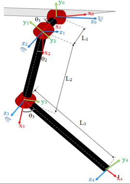

# Readme

A python library for forward and inverse kinematic operations on a spot micro quadruped.


This library is designed around the spot micro 3d printable model developed by KDY0523, which can be found on thingverse (https://www.thingiverse.com/thing:3445283). The only requirement for this library is numpy for matrix operations.

The forward and inverse kinematics of this library are based on the following paper:

    Sen, Muhammed Arif & Bakircioglu, Veli & Kalyoncu, Mete. (2017). 
    Inverse Kinematic Analysis Of A Quadruped Robot.
    International Journal of Scientific & Technology Research. 6.

The figures below, taken from the paper above, show the general leg  and robot geometry implemented in this library. Note, the robot geometry implemented in this library is different than that of the paper. Legs **1** and **3** are rotated 180 degrees, as that's the way they are oriented on the spot micro frame.




## Installation
This package can be installed via pip install. Reccomend installing into a virtual environment instead of to your system!
For example, if you have a python virtual environment somwhere, you could call pip install to the path of this package:
```pip install /your/path/to/spot_micro_kinematics/```

Alternatively, for a quick and dirty installation, copy the this package next to a python script that wants to use it.

```
├── your_script.py
└── spot_micro_kinematics
    ├── __init__.py
    ├── spot_micro_stick_figure.py
    ├── ...
```

And in your_script.py, just import:
```python
from spot_micro_kinematics.spot_micro_stick_figure import SpotMicroStickFigure
```


## Assumptions
This library contains various hard coded lengths of the spot micro frame as measured by me with a set of digital calipers. All dimensions are approximate at best. These lengths can be modified, they are the following properties of the SpotMicroStickFigure class:
```
hip_length
upper_leg_length
lower_leg_length
body_width
body_length
```

## Use

The library can be used by instantiating a SpotMicroStickFigure object at a height of 0.14 meters as follows. The constructor has optional arguments to set initial body x, y, z and phi, theta, psi position and orientation values. All distances are assumed to be meters, and all angles assumed to be radians.

```python
from spot_micro_kinematics.spot_micro_stick_figure import SpotMicroStickFigure

sm = SpotMicroStickFigure(x=0,y=0.14,z=0)
```

One reccomended use case is to set the absolute coordinates of all four feet at a height of 0, and at a neutral stance (where the feet are directly below the hip and shoulder joints). This can be done as follows:

```python
# Define absolute position for the legs
l = sm.body_length
w = sm.body_width
l1 = sm.hip_length
l2 = sm.upper_leg_length
l3 = sm.lower_leg_length
desired_p4_points = np.array([ [-l/2,   0,  w/2 + l1],
                               [ l/2 ,  0,  w/2 + l1],
                               [ l/2 ,  0, -w/2 - l1],
                               [-l/2 ,  0, -w/2 - l1] ])

sm.set_absolute_foot_coordinates(desired_p4_points)
```

Setting a body orientatation (for example a pitch angle of 10 degrees) can be set as follows:
```python
from math import pi
sm.set_body_angles(theta=10*pi/180.0)
```

Leg coordinates and leg joint angles can be retreived as follows:

```python
# Get leg coordinates
coords = sm.get_leg_coordinates()

# Get leg angles
leg_angs = sm.get_leg_angles()
```


## Limitations
This library contains no exception handling for attempting impossible poses. For example, if a foot position is set that is impossible to achieve, a domain error will result on an underlying trigonmetric function.

Additionally, this library assumes an idealized leg geometry compared to the actual spot micro 3d print model. In the real 3d model, the the first and second joints (the hip and shoulder joints) are offset height wise by approximately 1 cm. This library neglects this offset and computes about a leg as presented in the paper referenced above.

## Unit tests
This library contains some unit tests. They can be run by cloning the library, cd'ing to the root directory of the project, and then running the following command:
```python -m unittest discover -t ..```

## Plotting
Some basic plotting scripts are also provided in the tests folder. These require matplotlib. They can be executed by cd'ing to a directory one level above where this library is checked out, and running a command as folloiws if this library were checked out to a directory called smkpython:
`python -m smkpython.tests.plotting.plot_animation.py`

A sample of the animation is shown via the gif at the top of this readme.

